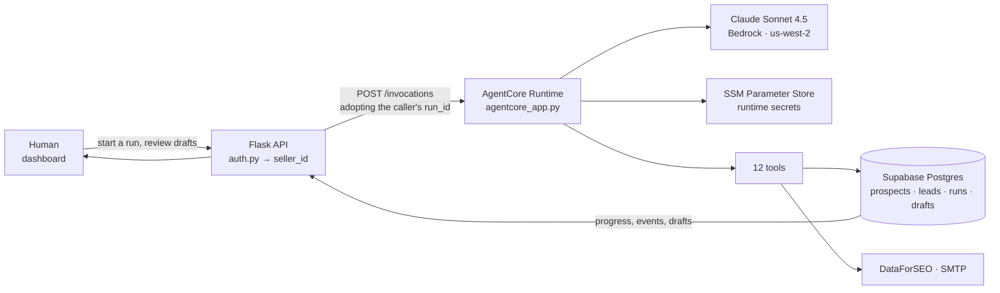

# Lead Engine

## One goal in. A researched shortlist, and the emails to go with it.

Tell it *"dentists in Austin."* It comes back with ten businesses that match
what you sell — and for each one, what they're actually missing:

> **no online booking** — every after-hours emergency call goes to whoever
> answers first
>
> **listing unclaimed** — Google set their hours and phone, and they can't fix
> them
>
> **no contact page** — the only way to reach them is a form that goes to an
> inbox nobody reads

And a first email for each of them. In your voice, about them.

Doing that by hand is an afternoon per batch: find the businesses, read the
sites, work out what's broken, write something that doesn't read like a
template. Lead Engine does that afternoon in a couple of minutes.

You read the drafts. You change what you want. You approve. They send.

---

## What that email actually looks like

Not this:

> Hi there, I came across your business and wanted to reach out about our
> services. We help businesses like yours grow...

This:

> **Subject:** the 9pm calls
>
> Hi Mike — I looked at your listing and noticed there's no way to book online.
>
> For a plumber that usually means one thing: someone's water heater gives out
> at nine at night, they search on their phone, and they call whoever they can
> book with first. That call doesn't come back in the morning.
>
> Worth ten minutes to fix? Happy to show you what it'd take.

*(A sample draft, shown to illustrate the shape. Real runs write about what they
actually find in each business's listing and site.)*

The difference isn't the writing. It's that one of them did the homework and the
other one didn't. Buyers can tell in the first line.

---

## Why it isn't just another mass-mailer

**It researches before it writes.** Every lead is scraped, checked against its
Google listing, and scored against *your* niche — before a word of outreach
exists. The email is downstream of what was actually found.

**It writes about a gap, never a compliment.** The scorer separates *evidence*
("strong digital presence") from *gaps* ("no booking link"). Only the gaps reach
the writer, because a compliment in a sales email reads as filler and gets you
deleted.

**It only knows what it can verify.** If Google says a listing is unclaimed, the
email can say so — the recipient can check that in five seconds. If Google says
nothing, the system stays quiet rather than guessing. A made-up detail in a cold
email costs you the client.

**The same search gives you the same leads.** Finding, enriching and storing are
deterministic code, not model improvisation, so your results are reproducible
and your pipeline isn't a slot machine.

---

## It sounds like you, because it's built on you

Your niche. Your voice. Your positioning.

Load your profile, your resume, your portfolio — the writer works from them, in
the first person. **Settings → Sending** takes your own Gmail, Brevo or Zoho
credentials, so the mail leaves from your address, with your name on it, and
replies land in your inbox. Not a platform's.

Every seller on the system is fully separate: own niche, own voice, own sending
identity, own provider keys. Nobody sees anybody else's pipeline.

---

## Where it runs

A [Strands Agents](https://strandsagents.com) agent on **Amazon Bedrock
AgentCore**, in `us-west-2`, reasoning with **Claude Sonnet 4.5**. Leads, runs
and drafts live in **Supabase**. It's deployed and live — not a notebook, not a
demo reel.

Start a run from the dashboard and watch it work: live progress, the searches it
ran, the leads it found, the drafts it wrote. Cancel it any time.

The dashboard shows you exactly why every run ended — target reached, searches
used up, nothing left to find — so a thin result is never a mystery.

---

## Try it

```bash
python -m venv venv
venv/Scripts/activate            # Windows;  source venv/bin/activate on Unix
pip install -r python-app/requirements.txt

cp .env.example .env              # then fill it in — see python-app/.env.example

# Run BOTH schema files in the Supabase SQL editor:
#   supabase-schema.sql         pipeline tables
#   supabase-schema-agent.sql   runs, run_events, drafts + the send guards

cd python-app && python app.py    # http://127.0.0.1:5000
```

Open <http://127.0.0.1:5000>, sign up, connect your providers, and give it a
goal.

**Required env:** `SUPABASE_URL`, `SUPABASE_SERVICE_KEY`, `SUPABASE_ANON_KEY`,
`CRED_ENCRYPTION_KEY`, `DEFAULT_SELLER_ID`, and at least one LLM provider key.
Sending and file storage are optional and default to off.

**Two setup steps that will bite you if you skip them:**

Create a **private** bucket called `resumes` in Supabase Storage (keep *Public*
off — a public bucket exposes every seller's CV to anyone with the URL).

In Supabase → Authentication → Providers, enable Email and **turn OFF "Confirm
email."** With it on, signup appears to succeed but login fails until the user
clicks a link in an email that may never arrive.

---

## Going live on AWS

```bash
# From the REPO ROOT, not agentcore/. The CLI reads agentcore/agentcore.json from
# the project root and refuses to run anywhere else — including from agentcore/,
# where it prints a "run this from your project root" hint and exits 0.
agentcore deploy                 # first run also does an npm install; slow, not hung
agentcore status                 # READY, and the runtime ARN
```

Then point the dashboard at it:

```
AGENT_BACKEND=agentcore
AGENTCORE_RUNTIME_ARN=arn:aws:bedrock-agentcore:us-west-2:...:runtime/leadgen-...
AGENTCORE_REGION=us-west-2
```

Runs now execute in AWS instead of in your web process — same dashboard, same
live progress, same result. Secrets are read from SSM Parameter Store at boot,
so they never enter the image, and browser profiles used for scraping stay on
your machine. **Redeploy after changing anything the agent imports.**

### The dashboard itself

The web app is a second image (`Dockerfile.web`) on **ECS Fargate**, behind an
ALB. `./Dockerfile` is the n8n image and is untouched — n8n keeps talking to a
local Flask, while this instance serves the same app from the same Supabase.

```bash
bash deploy-dashboard.sh          # package -> CodeBuild -> ECR -> rolling ECS
```

Nothing is installed locally to do this: this machine has no Docker, so
CodeBuild (which does) builds the image and pushes it to ECR. The script exists
because two of its four steps are silent when skipped — `start-build` returns
before the build finishes, and ECS keeps the old container unless you pass
`--force-new-deployment`.

The service runs one worker with eight threads rather than the usual worker
per core: `POST /runs` answers immediately and does the work on a daemon thread,
so a second worker would only add a second thing that can be recycled mid-run.

**Three settings are not defaults, and all three matter:**

| Setting | Why |
|---|---|
| `AUTH_REQUIRED=true` | This is the *public* instance. Left at the local default of `false`, every seller route is open to anyone with the URL. |
| `LEADGEN_SECRETS_PATH=/leadgen/` | Reads the 16 parameters from SSM at boot. Nothing secret is in the image. |
| `AGENT_BACKEND=agentcore` | Runs the agent in the runtime rather than in the web process. |

`SERVICE_TOKEN` is deliberately **not** set here. It grants platform scope —
the right to act on any tenant — and the dashboard never needs that: every page
names its subject through the bearer token instead. n8n is the only caller that
needs it, and n8n talks to the local instance. Putting it on a public service
would add reach nobody asked for.

The deployment is HTTP on an ALB DNS name. Adding HTTPS is an ACM certificate
and a listener on 443; there is no domain on this account yet.

---

## Under the hood

<details>
<summary><b>Architecture</b></summary>



Also as a picture: [`assets/architecture.svg`](assets/architecture.svg).

Progress is a **database** fact, not a process fact. The runtime adopts the run
row the dashboard already created, so you watch a run happen live in AWS from a
browser on your laptop. Cancel needs two mechanisms because a `threading.Event`
can't cross a process boundary — a local event and a `runs.cancel_requested`
column, checked between turns, so a call already in flight still finishes.

Send safety is enforced **below** the app: `idx_drafts_sent_once` is a partial
unique index on `drafts(lead_id) WHERE status='sent'`. Double-sending the same
person is impossible at the database level, not just in code that might forget.

</details>

<details>
<summary><b>The twelve tools the agent reasons with</b></summary>

Everything the agent can do is on this list, and nothing else is reachable.

| Tool | What it does |
|---|---|
| `find_leads` | Search Maps by keyword and place — then enrich, score and store |
| `read_leads_tool` | List stored leads for a campaign, best first |
| `campaign_summary` | Counts: total, qualified, by status |
| `score_niche_fit` | Re-score one lead's fit against your niche |
| `draft_outreach` | Write a personalized email and save it as a draft |
| `revise_draft` | Rewrite a draft from specific feedback |
| `seller_profile` | Who this run is working for |
| `update_seller_profile` | Update the profile as it learns |
| `set_resume_text` | Store resume text for attachment |
| `fetch_portfolio` | Pull a portfolio into the run's context |
| `provider_config` | Which providers are configured, whether secrets are set |
| `set_lead_status` | Move leads through the lifecycle |

A run is bounded in Python, never by the prompt: searches, model calls, turns,
wall clock and estimated spend are counters that raise **before** the work
happens, so the model can't talk its way past them. Every run ends in exactly
one recorded reason — `target_met`, `budget_exhausted`, `max_attempts`,
`timeout`, `no_results`, `user_cancelled`, `error` — or it's a bug.

`no_results` exists separately on purpose: the loop counts consecutive turns
that changed nothing and gives up, because an agent that's talking but not
working is not making progress.

</details>

<details>
<summary><b>Adding one business by hand</b></summary>

`POST /prospects/direct` takes a single business by `place_id`, `cid`, or name —
the referral, the shop you drove past. It stores the prospect and stops: no
search, no spend beyond one lookup, ready for you to act on.

</details>

<details>
<summary><b>API</b></summary>

```
# pipeline
POST /campaign            POST /leads            POST /leads/status
POST /draft               GET  /seller/by-email  POST /seller
POST /prospects/direct

# agent runs
POST /runs                POST /runs/list        GET  /runs/<id>
GET  /runs/<id>/events?after=<seq>                POST /runs/<id>/cancel

# drafts
POST /drafts              POST /drafts/list      GET/PATCH /drafts/<id>
POST /drafts/<id>/approve POST /drafts/<id>/reject POST /drafts/<id>/send
POST /drafts/<id>/export  POST /drafts/export

# seller (self-service)
GET  /seller/me           PATCH /seller/<id>     POST /seller/<id>/resume
POST /seller/<id>/portfolio                      GET/PATCH /seller/<id>/config
```

Every response is `{"ok": true, ...}` or `{"ok": false, "error": "..."}`.

</details>

<details>
<summary><b>Tests</b></summary>

```bash
cd python-app && python -m pytest        # 443 tests
```

`tests/conftest.py` blocks all real network requests, and pins the three
switches that otherwise leak in from `.env` (`SEND_BACKEND`, `AGENT_BACKEND`,
`AUTH_REQUIRED`). The result is the same 441 whether your `.env` says
`AUTH_REQUIRED=true` or `false`. The enforced posture is still covered: every
test in `test_seller_route_scoping.py` sets the flag explicitly.

The ones worth knowing: `test_orchestrator_stop_reasons.py` (every terminal
reason, no model), `test_lead_naming.py` (a compliment never reaches the writer
as a defect), `test_sender_identity.py` (a seller's From is ignored without
their own credentials, and says so), `test_stop_reason_vocabulary.py`,
`test_budget.py`, `test_routes_ui.py`.

</details>

<details>
<summary><b>Repository layout</b></summary>

```
python-app/
  agentcore_app.py    the deployed entrypoint — AgentCore runtime
  app.py              Flask app — pipeline + seller routes
  auth.py             credential -> seller_id
  routes_agent.py     /runs, /drafts, /prospects/direct
  routes_ui.py        the pages
  lead_engine.py      the FIND -> ENRICH -> SCORE -> STORE pipeline
  scoring.py          deterministic scoring, shared with the model
  dataforseo.py       Maps search + single-business lookup
  seller_ops.py       one implementation of the seller/lead write rules
  draft_compose.py    one implementation of draft composition
  send_provider.py    how mail leaves (none | ses | smtp)
  file_store.py       where a file's bytes live (none | supabase | s3 | local)
  draft_send.py       one implementation of "send this draft as this seller"
  agent/
    orchestrator.py   the loop
    budget.py         the caps
    tools.py          the 12 tools
    run_store.py      runs, events, drafts
  providers/          swappable LLM + source implementations
  templates/ static/  dashboard
agentcore/            AgentCore deployment (CDK)
Dockerfile.web        the dashboard image (the root Dockerfile is n8n)
buildspec.yml         CodeBuild: build Dockerfile.web, push to ECR
deploy-dashboard.sh   package -> build -> roll ECS, in one command
supabase-schema*.sql  schema — run both
assets/               architecture diagram
```

</details>

<details>
<summary><b>The honest bit</b></summary>

A reader who probes this should find the README told them the truth.

**Working today:** the agent and all twelve tools, bounded stop reasons, the
live dashboard with review and approval, per-seller sending identity, CSV
export, and the deployed AgentCore runtime.

**Not wired:** SES sending. `SEND_BACKEND` defaults to `none`, and under it the
send endpoint refuses with a message naming the missing setting. `smtp` is the
path that works today — any free provider, one block of env vars.

**Known gaps:**

- **The AgentCore runtime is IAM-gated, but has no *authorisation* gate.**
  It is not a public endpoint — an unsigned `POST /invocations` is refused with
  403 `Missing Authentication Token`, and only a SigV4-signed call from a
  principal holding `bedrock-agentcore:InvokeAgentRuntime` reaches it. What is
  missing is the layer above: `_resolve_seller_id` takes `seller_id` from the
  payload, so a caller who can already invoke the runtime can name any tenant.
  That is intra-account privilege escalation, not an open door.

  Closing it properly is not just a check in `invoke()`: AgentCore does not pass
  the caller's IAM identity into the runtime — `RequestContext` carries only
  `session_id`, `request_headers` and the raw Starlette request — so there is no
  "who called me" for the runtime to compare a claimed `seller_id` against. The
  route would be a shared secret in a header (that is what `request_headers` is
  for), which the Flask caller would have to send on every invoke.
- **The Flask API is unauthenticated by default.** `AUTH_REQUIRED` defaults to
  `false`, and under it the API is open — that is what the flag means, and it is
  what keeps the five n8n workflows running with no credential. Turn it on and
  the tenant routes require a bearer or service token; set `SERVICE_TOKEN`
  *before* flipping it, or n8n loses its platform scope.

  Once on, the scoping is real: `/seller/<seller_id>/*` compares the id in the
  URL against the credential (a bearer token is one tenant and may only touch
  its own row; a valid service token is the platform and may touch any), and
  `POST /seller`, `/seller/list` and `/seller/by-email` — which name their
  subject in the body or a query parameter and so have no id to compare against
  a credential — are operator-only. Covered by `test_seller_route_scoping.py`
  from both sides.

**Spend is always an estimate.** `lead_engine` reports no real cost data, and
the UI never implies otherwise.

</details>

---

Built for the **Agents for Humans** hackathon.
